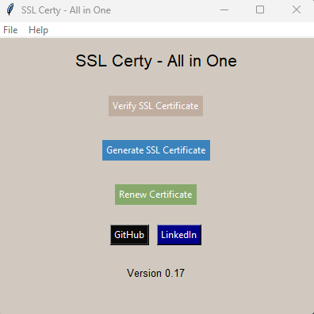

# SSL Certificate Verification & Generation

This is a Python application built using the tkinter library for SSL certificate verification and generation. It provides the following functionalities:

- Verification of SSL certificates by either uploading a .pem file or entering a URL.
- Displaying detailed information about the verified SSL certificate.
- Generation of self-signed SSL certificates with customizable parameters.

## Features

- Verification of SSL Certificates:
  - Upload a .pem file or enter a URL to verify the SSL certificate.
  - Display detailed information about the verified certificate, including subject name, issuer name, validity, and fingerprint.

- Generation of SSL Certificates:
  - Generate self-signed SSL certificates with customizable parameters.
  - Specify the key size, common name, validity period, and hash algorithm.
  - Export the generated certificate as a .pem file.

## Requirements

- Python 3.xx
- tkinter
- ssl
- socket
- urllib.parse
- datetime
- collections
- cryptography
- OpenSSL
- webbrowser
- idna

## Usage

1. Install the required dependencies mentioned in the "Requirements" section.
2. Run the Python script: `python ssl-certy.py`.
3. The main window of the application will open, displaying the options to verify and generate SSL certificates.
4. Click on the "Verify SSL Certificate" button to verify a certificate.
5. Choose the verification method (upload a .pem file or enter a URL) and follow the instructions.
6. The certificate details will be displayed in a separate window.
7. Click on the "Generate SSL Certificate" button to generate a self-signed certificate.
8. Fill in the required information (key size, common name, validity period, and hash algorithm) and click on the "Generate" button.
9. Choose the location to save the generated certificate file (.pem) when prompted.
10. The certificate will be saved, and a message will be displayed with the file path.

## Screenshots
### Main Window

### Certificate Verification

### Certificate Details

### Certificate Details

### Certificate Generation

## Additional Information

- Author: Khalid LAAOUISSI
- LinkedIn: https://www.linkedin.com/in/laaouissikh/

Feel free to reach out if you have any questions or suggestions!
